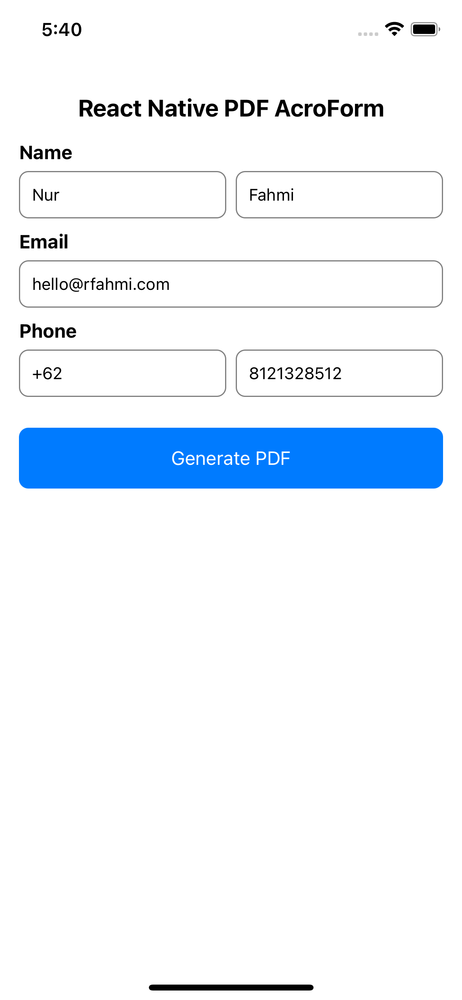
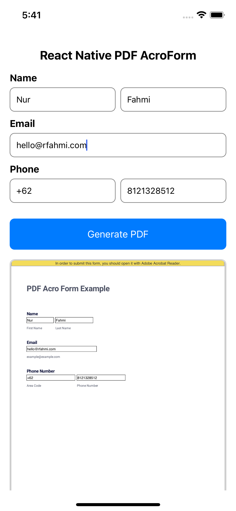
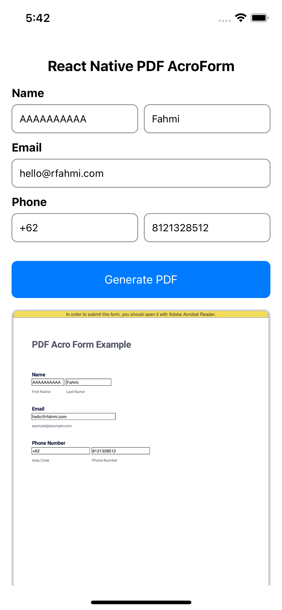

# React Native PDF Acro Form

This project allows users to interact with PDF forms, input their information, and generate filled PDF documents.

## Project Overview
This project focuses on providing users with a seamless experience when interacting with PDF AcroForms on mobile devices. It enables users to input their data into specific fields and generates a filled PDF document with the entered information.

### Initial State

This screenshot illustrates the initial state of the application, providing users with a clear starting point for inputting their data.

### Generated PDF

Upon user input, the application generates a filled PDF document. This allows users to review and confirm the accuracy of their entered information before proceeding.

### Updated PDF Data

This screenshot showcases an updated PDF document with user-inputted data. The application ensures that the PDF reflects the latest user-provided information accurately.
